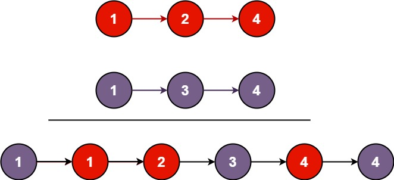

# Introduction 

#### 将两个升序链表合并为一个新的 升序 链表并返回。新链表是通过拼接给定的两个链表的所有节点组成的。



### 输入：l1 = [1,2,4], l2 = [1,3,4]
### 输出：[1,1,2,3,4,4]

---

## Solution1:

```cpp
class Solution {
public:
    ListNode* mergeTwoLists(ListNode* list1, ListNode* list2) {
        ListNode dummy(0);  //创建一个值为 0 的“假节点”（假头节点）
        ListNode* tail = &dummy;
        while(list1 && list2){
            if(list1->val <= list2->val){
                tail->next = list1;
                list1 = list1->next;
            } else {
                tail->next = list2;
                list2 = list2->next;
            }
            tail = tail->next;
        }
        if(list1) tail->next = list1;
        if(list2) tail->next = list2;
        return dummy.next;
    }
};

```
或者
```cpp
class Solution {
public:
    ListNode* mergeTwoLists(ListNode* l1, ListNode* l2) {
        if (l1 == nullptr)
            return l2;
        else if (l2 == nullptr)
            return l1;
        else if (l1->val < l2->val) {
            l1->next = mergeTwoLists(l1->next, l2);
            return l1;
        } else {
            l2->next = mergeTwoLists(l1, l2->next);
            return l2;
        }
    }
};
```
