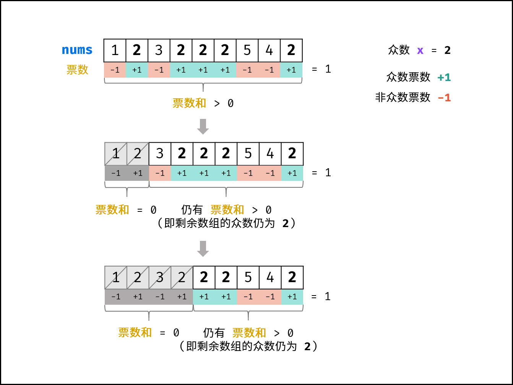

# Introduction
给定一个大小为 n 的数组 nums ，返回其中的多数元素。多数元素是指在数组中出现次数 大于 ⌊ n/2 ⌋ 的元素。

你可以假设数组是非空的，并且给定的数组总是存在多数元素。

---
输入：nums = [3,2,3]
输出：3

输入：nums = [2,2,1,1,1,2,2]
输出：2

---

# Solution


本题常见的三种解法：

**哈希表统计法： 遍历数组 nums ，用 HashMap 统计各数字的数量，即可找出 众数 。此方法时间和空间复杂度均为 O(N) 。**

**数组排序法： 将数组 nums 排序，数组中点的元素 一定为众数。**

**摩尔投票法： 核心理念为 票数正负抵消 。此方法时间和空间复杂度分别为 O(N) 和 O(1) ，为本题的最佳解法。**



众数为 x ，遍历并统计票数。当发生 票数和 =0 时，剩余数组的众数一定不变 ，这是由于：


### 算法流程:
1. 初始化： 票数统计 votes = 0 ， 众数 x。
2. 循环： 遍历数组 nums 中的每个数字 num 。
3. 当 票数 votes 等于 0 ，则假设当前数字 num 是众数。
4. 当 num = x 时，票数 votes 自增 1 ；当 num != x 时，票数 votes 自减 1 。
5. 返回值： 返回 x 即可。

---

## C++
```cpp
class Solution {
public:
    int majorityElement(vector<int>& nums) {
        int x = 0;
        int votes = 0;
        for (int num : nums) {
            if (votes == 0) {
                x = num;
            }
            votes += num == x ? 1 : -1;
        } 
        return x;
    }
};
```